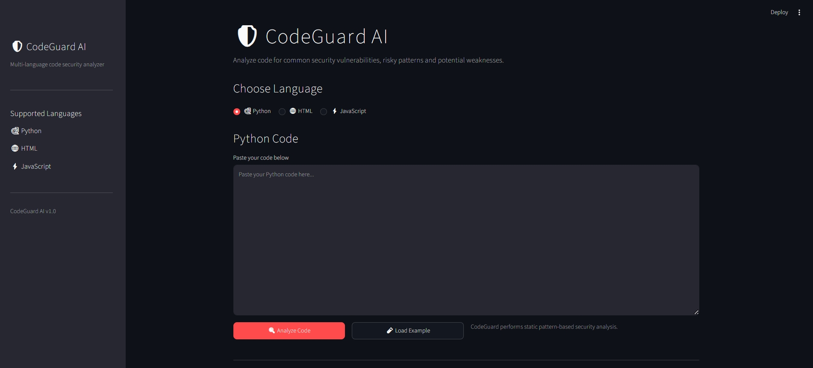
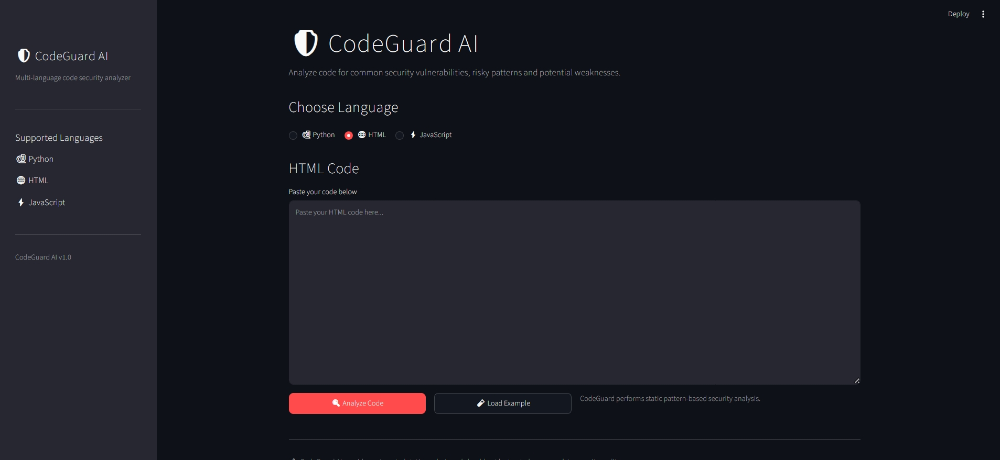
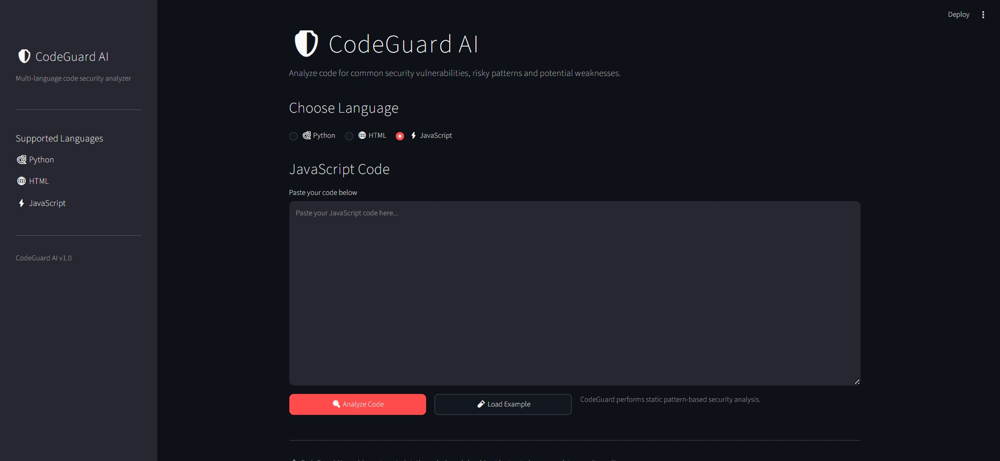

# 🛡️ CodeGuard AI

> A multi-language static code security analyzer for Python, HTML, and JavaScript.

CodeGuard AI is a developer-focused security analysis platform that detects common vulnerable coding patterns, evaluates security risk, maps findings to **CWE** and **OWASP Top 10**, provides remediation guidance, and generates professional security reports.

It also includes a **Fix & Rescan** workflow that lets developers measure security improvements after fixing vulnerabilities.

---

## ✨ Features

### 🔍 Multi-Language Analysis

CodeGuard AI currently supports:

- 🐍 Python
- 🌐 HTML
- ⚡ JavaScript

Each language has dedicated security detection rules.

### 🛡️ Security Scoring

Every scan generates:

- Security Score — 0–100
- Security Grade — A–F
- Risk Level
- Critical / High / Medium / Low findings
- Total vulnerabilities
- Detection confidence

### 🧩 CWE & OWASP Mapping

Security findings are mapped to recognized security standards including:

- CWE identifiers
- OWASP Top 10 categories
- Severity classification
- Detection confidence

Example:

```text
Unsafe eval() usage

Severity: CRITICAL
CWE: CWE-95
OWASP: A03:2021 – Injection
Confidence: 99%
```

### 📍 Detailed Findings

Every detected issue provides:

- Vulnerability title
- Severity
- Line number
- CWE classification
- OWASP category
- Detection confidence
- Evidence
- Explanation
- Remediation recommendation

This allows developers to understand not only **what is wrong**, but also **why it matters and how to improve it**.

### 🔧 Fix & Rescan

CodeGuard AI includes an iterative security workflow:

```text
Vulnerable Code
      ↓
   Analyze
      ↓
Security Score
      ↓
   Fix Code
      ↓
  Rescan
      ↓
Before vs After
```

The application compares:

- Security score
- Security grade
- Issues remaining
- Issues resolved

Example:

```text
Before
Security Score: 0/100
Issues: 7
Grade: F

        ↓ Fix & Rescan

After
Security Score: 100/100
Issues: 0
Grade: A
```

### 📄 Security Reports

Generate a downloadable PDF security report containing:

- Security score
- Security grade
- Risk level
- Severity breakdown
- Security intelligence
- CWE mappings
- OWASP mappings
- Confidence scores
- Affected lines
- Evidence
- Recommendations

---

## 🖥️ Interface

### Python



### HTML



### JavaScript



---

## 🏗️ Architecture

```text
                    CodeGuard AI
                         │
              ┌──────────┼──────────┐
              │          │          │
           Python       HTML    JavaScript
           Analyzer    Analyzer    Analyzer
              │          │          │
              └──────────┼──────────┘
                         │
                  Finding Engine
                         │
          ┌──────────────┼──────────────┐
          │              │              │
        CWE            OWASP        Confidence
          │              │              │
          └──────────────┼──────────────┘
                         │
                  Security Scoring
                         │
              ┌──────────┴──────────┐
              │                     │
         Result Dashboard      PDF Report
              │
         Fix & Rescan
              │
        Before / After
```

---

## 🛠️ Tech Stack

- **Python**
- **Streamlit**
- **AST-based Python analysis**
- **Regex-based security pattern analysis**
- **ReportLab**
- **CWE**
- **OWASP Top 10**
- **Git / GitHub**

---

## 🚀 Getting Started

### 1. Clone the repository

```bash
git clone https://github.com/palashgoyalatwork/CodeGuardAI
cd CodeGuardAI
```

### 2. Install dependencies

```bash
pip install -r requirements.txt
```

### 3. Run CodeGuard AI

```bash
streamlit run app.py
```

The application will open in your browser.

---

## 🧪 Example Vulnerabilities Detected

CodeGuard AI can identify patterns such as:

### Python

```python
eval(user_input)
```

```python
os.system(user_input)
```

```python
subprocess.run(command, shell=True)
```

```python
query = "SELECT * FROM users WHERE name = '" + username + "'"
```

### JavaScript

```javascript
eval(userInput);
```

```javascript
document.write(userInput);
```

```javascript
element.innerHTML = userInput;
```

### HTML

```html
<a href="javascript:alert('XSS')">
```

```html
<script>
    // inline JavaScript
</script>
```

---

## 📊 Security Philosophy

CodeGuard AI follows a simple principle:

> **Detect → Explain → Fix → Rescan**

The goal is not simply to tell developers that their code is vulnerable, but to help them understand the issue, apply a fix, and verify whether the security posture improved.

---

## ⚠️ Disclaimer

CodeGuard AI performs automated static pattern-based analysis.

It is **not a replacement for a professional penetration test, comprehensive security audit, or manual code review**.

Detected findings should be manually reviewed before making production security decisions.

---

## 👨‍💻 Author

**Palash Goyal**

Built as a cybersecurity-focused developer portfolio project exploring:

- Static code analysis
- Application security
- Secure coding practices
- CWE / OWASP classification
- Developer security tooling

---

## 📌 Project Status

**Current Version:** v1.0

### Implemented

- [x] Python security analysis
- [x] HTML security analysis
- [x] JavaScript security analysis
- [x] Security scoring
- [x] Security grading
- [x] CWE mapping
- [x] OWASP mapping
- [x] Confidence scoring
- [x] Evidence extraction
- [x] Remediation guidance
- [x] PDF security reports
- [x] Fix & Rescan
- [x] Before / After comparison

### Planned

- [ ] Full project / ZIP scanning
- [ ] Additional language support
- [ ] Expanded vulnerability rule library
- [ ] CI/CD integration
- [ ] AI-assisted remediation explanations

---

⭐ If you find CodeGuard AI interesting, consider starring the repository.
